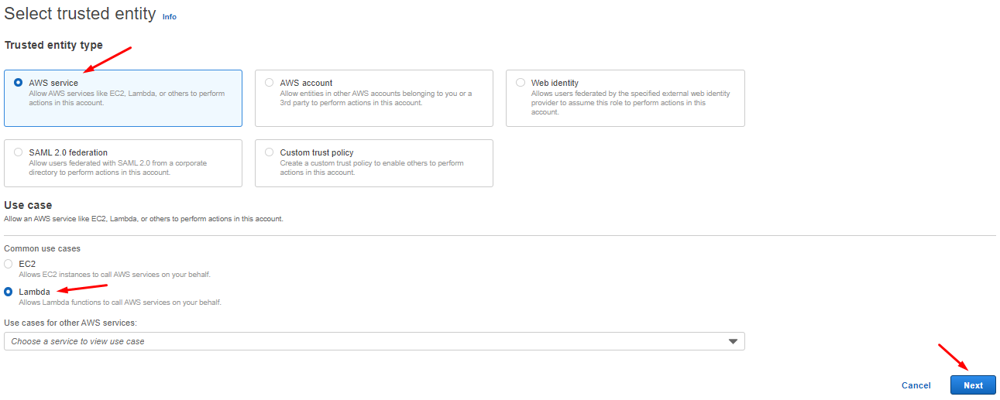
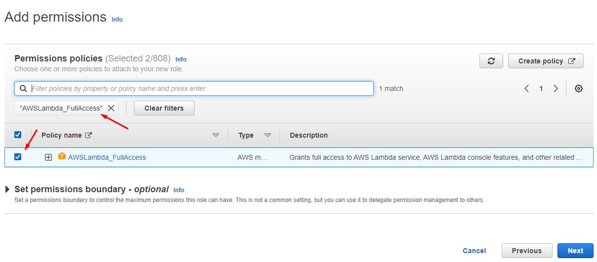
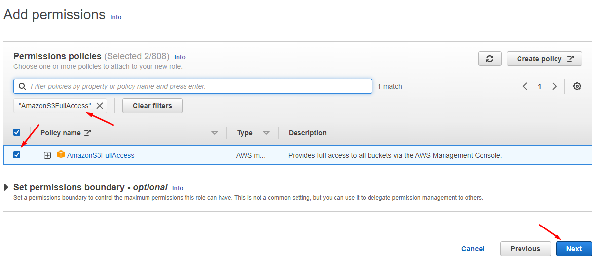
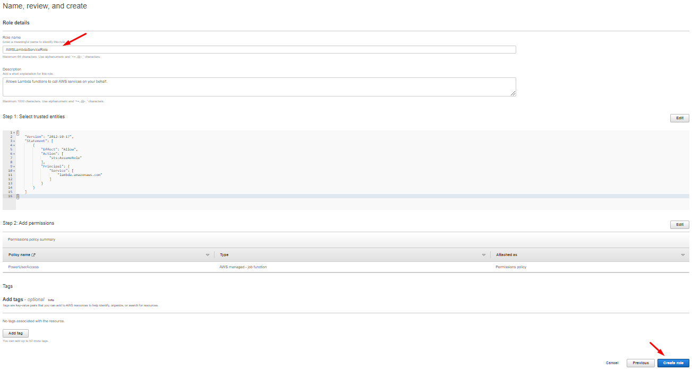
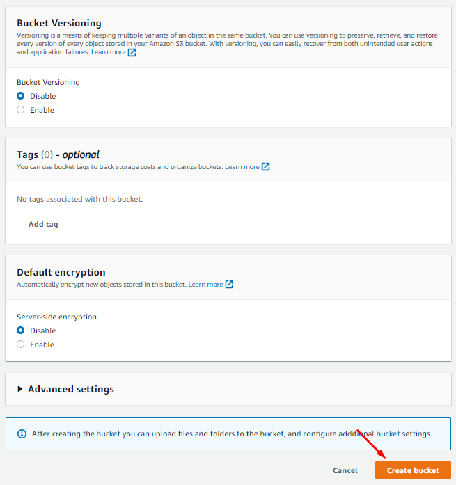
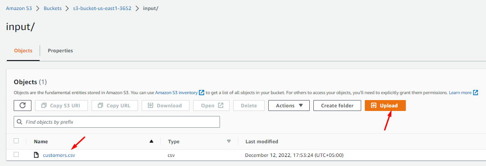
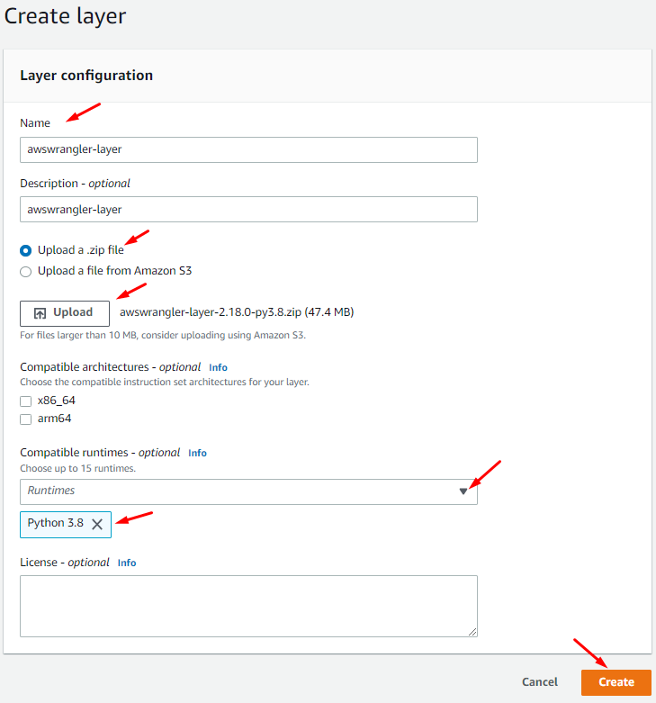
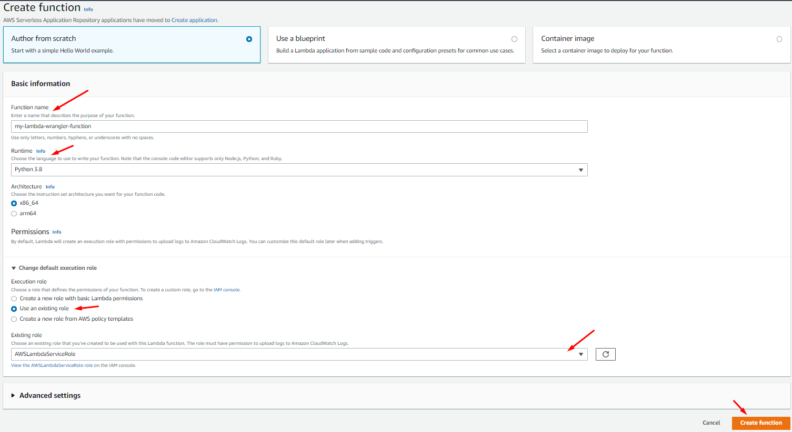
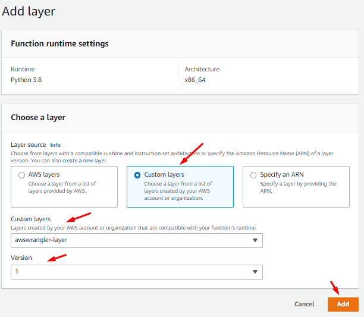

# AWS Data Wrangler (awswrangler) with Lambda and AWS S3
  
## Description
Walkthrough on how to install [AWS Data Wrangler Python Library](https://github.com/aws/aws-sdk-pandas/releases) on an AWS Lambda Function through the AWS console with reading/writing data on S3.
  
## Overview
In this exercise, we will learn how to use `AWS Data Wrangler` with `AWS Lambda` Function and `S3`.
  
## Prerequisites
We need to have an `AWS account` with administrative access to complete the exercise. If you don’t have an AWS account, kindly create free trial account for AWS.
  
### Step - 1
----
We start with creation of the `IAM role` which `AWS Lambda` function uses for the authorization to call other AWS Services. Login to the AWS Console, select nearest `region` as your region.

Goto the `IAM Management` console and click on the `Roles` menu in the left panel and then click on the `Create role` button.


  
Select `AWS Services`, select `Lambda` as a service and click the `Next` button



  
On the next screen, search `AWSLambda_FullAccess`, select then clear the search bar and again search `AmazonS3FullAccess` from the permissions policies, select and click on the `Next` button.



  
Type and Enter for search


  


  
On the next screen, type the name for the `Role name` and click on the `Create role` button.



  
The role is created in the next step, we are creating the `S3` bucket and upload a sample data file into it.

  
### Step - 2
----
Now, we create an Amazon `S3` bucket and upload a sample file [customers.csv](https://github.com/masood2iq/AWS-Data-Wrangler-awswrangler-with-Lambda-and-S3/blob/main/customers.csv) to it. The Lambda function will use `Pandas` and `Data Wrangler` to read this file, transform and then upload back to S3 bucket.

Goto AWS `S3 Management` Console, create an S3 bucket with the any `unique name`. If this bucket name already exists; create a bucket with the name which is available. After that create two folders - `input and output` in this bucket.


  

  

  


  
Navigate to the `input` folder and upload `customers.csv` file into it.



  
The S3 bucket and the data is ready. Let’s configure `Lambda layer` for the Data Wrangler in the next step.
  
### Step - 3
----
Now, we configure `Lambda Layer` for the AWS Data Wrangler which is then used by `Lambda Function` to call `Pandas` and `Data Wrangler` APIs.
Download `awswrangler-layer-x.x.x-py3.8.zip` file from the [link](https://github.com/aws/aws-sdk-pandas/releases).

Goto `Lambda Management` console, select `Layers` menu in the left panel and then click on the `Create layer` button.


  
On the next screen, type the name, select Upload a .zip file option and upload `awswrangler-layer-x.x.x-py3.8.zip` file you downloaded in the previous step. Select `Python 3.8` for the runtime. Finally click on the `Create` button.



  
The Lambda Layer is created in no time. In the next step, we create `Lambda function`.
  
### Step - 4
----
Now, we create a `Lambda function` which uses `awswrangler` layer and runs code to read `S3` file, transform and then write back to the `S3` bucket.
Goto `Lambda Management` console and click on the `Create function` button.


  
On the next screen, select `Author from scratch` as the option. Type in the `Function name`. Select `Python 3.8` as the Runtime. Under Permissions, select `Use an existing role` as the option and then select `AWSLambdaServiceRole` (we created in the earlier steps) as the `role`. Finally, click on the `Create function` button.



  
The `Lambda function` is created. Click on the `Layers` link.


  
It will expand the layers section on the Lambda configuration screen. Click on the `Add a layer` button.


  
On the next screen, select `Custom layers` option. Select `awswrangler-layer` as the custom layer. Select `1` as the `version`. Click on the `Add` button.



  
The layer is added to the Lambda function. Next click to the `Configuration` section tab and click on the `Edit` button.


  
On the next screen, change `memory` to `256 MB` and change `timeout` to `5 mins`. Then click on the `Save` button.


  
Finally, time to write the code for the Lambda Function. Goto the `Function code setting` for the lambda function and replace the code with the code below and then click on the `Deploy` button. If you created bucket with a different name, update the code to use the bucket you created.

``` py
import json
import awswrangler as wr
from datetime import datetime

def lambda_handler(event, context):
    
    df = wr.s3.read_csv("s3://s3-bucket-us-east1-3652/input/", dataset=True)
    
    df = df [["CUSTOMERNAME","EMAIL"]]
	
    wr.s3.to_json(df,"s3://s3-bucket-us-east1-3652/output/mydata.json")
    
    return {
        'statusCode': 200,
        'body': json.dumps('Successful')
    }
```


  
Click on the `Deploy' button, the function code is updated. In the code above, we first import `awswrangler` library from the Layer. We then use `wrangler api` to read data from the `S3 bucket` and populate to a pandas dataframe. We then apply a small transformation to select only two columns out of the dataframe. Finally, we use `wrangler api` to write the transformed `dataframe` to the `S3 bucket` in the `CSV` format.

The lambda function code and configuration is ready and good to run. Click on the `Test` button a pop-up window will open. On the next screen, type in the `Event name`. Leave the input to the default as you are not using input anyway. Finally, click on the `Save` button.


  
The test is created, keeping selected, click on the `Test` button again. The function runs successfully and you can see the success message returned.


  
The Lambda function has written the output in the S3 bucket. We can check the output json data file in S3.


  
### Step - 5
----
Finally, we clean-up the resources so that we don’t incur any cost for that:
- Delete `awswrangler-layer` from `Layers` in the AWS Lambda console.
- Delete `my-lambda-wrangler-function` function from the AWS Lambda console.
- Delete the `S3 bucket` from the S3 Management Console.
- Delete `AWSLambdaServiceRole` in IAM role from the IAM Management console.
